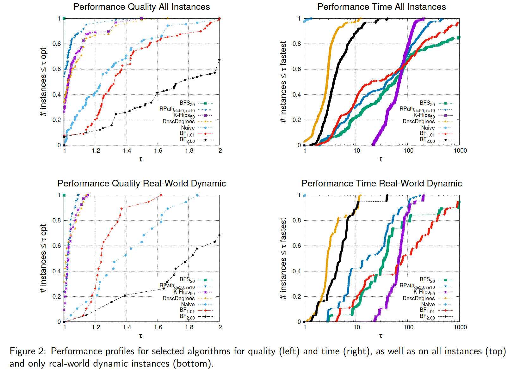
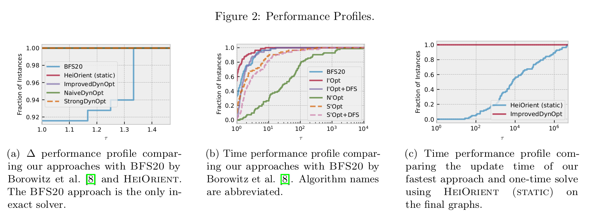

# Engineering Fully Dynamic Heuristic and Exact $\Delta $-Orientation Algorithms
[](https://opensource.org/licenses/MIT) [](https://app.codacy.com/gh/DynGraphLab/DynDeltaOrientation/dashboard?utm_source=gh&utm_medium=referral&utm_content=&utm_campaign=Badge_grade)

This is repository implements and benchmarks state-of-the-art and new approaches to the problems of finding optimal as well as good delta-orientations for sparse graphs. A (fully) dynamic graph algorithm is a data structure that supports edge insertions, edge deletions, and answers specific queries pertinent to the problem at hand. In this work, we address the fully dynamic edge orientation problem, also known as the fully dynamic $\Delta$-orientation problem. The objective is to maintain an orientation of the edges in an undirected graph such that the out-degree of any vertex remains low. When edges are inserted or deleted, it may be necessary to reorient some edges to prevent vertices from having excessively high out-degrees.  While there has been theoretical work on dynamic versions of this problem, currently has been little effort in experimentation. We close this gap and engineer a range of new dynamic edge orientation algorithms as well as algorithms from the current literature and make them available here. 

The repository contains two types of algorithms -- exact algorithms and heuristics. The best heuristic algorithm considered in this paper in terms of quality, based on a simple breadth-first search, computes the optimum result on more than 90% of the instances and is on average only 2.4% worse than the optimum solution. Our exact algorithm maintains an optimal edge orientation during both insertions and deletions. The update time of our algorithm is up to 6 orders of magnitude faster than static exact algorithms.  This repository is joint work of Jannick Borowitz, Ernestine Großmann, Henrik Reinstädtler, Christian Schulz and Fabian Walliser. 

Performance of Heuristic Algorithms
=====

<p align="center">

</p>


Performance of Exact Algorithms
======
<p align="center">

</p>


## Compilation

Before you can start you need to install the following software packages:

- if you want to use ILPs, then you need to install Gurobi first 

Once you installed the packages, just type 
```console
./compile_withcmake.sh -DILP=On
```
In this case, all binaries, libraries and headers are in the folder ./deploy/ 

Note that this script detects the amount of available cores on your machine and uses all of them for the compilation process. If you don't want that, set the variable NCORES to the number of cores that you would like to use for compilation. 

Alternatively use the standard cmake build process:
```console 
mkdir build
cd build 
cmake ../ -DCMAKE_BUILD_TYPE=Release -DILP=On
make 
cd ..
```
In this case, the binaries, libraries and headers are in the folder ./build as well as ./build/
If you don't want to use ILPs, you can run

```console 
./compile_withcmake.sh -DILP=Off
```

In this case, all components of the programs using ILPs will be disabled and Gurobi is not required.

## Example run

First unpack the example network: 

```console
cd examples
tar xfz *.tar.gz
```
Then run

```console
$./deploy/delta-orientations examples/youtube-u-growth.seq --algorithm=IMPROVEDOPT 
io took 2.30678
time             8.9803
maxOutDegree     78
```

```console
$ ./deploy/delta-orientations examples/youtube-u-growth.seq --algorithm=NAIVE
io took 4.60033
time 		 0.922766
maxOutDegree 	 118
```

```console
$ ./deploy/delta-orientations examples/youtube-u-growth.seq --algorithm=MAXDECENDING --depth=10
io took 4.48079
time 		 4.0129
internal max deg 78
maxOutDegree 	 78
```

```console
$ ./deploy/delta-orientations examples/youtube-u-growth.seq --algorithm=KFLIPS --flips=10
io took 4.41465
time 		 9.14307
internal max deg 82
maxOutDegree 	 82
```

For more options and algorithms run

```console
$ ./deploy/delta-orientations  --help
```

Licence
=====
The program is licenced under MIT licence.
If you publish results using our algorithms, please acknowledge our work by quoting the following two papers.
If you used the exact algorithms:

```
@article{grossmann2024engineering,
  title={Engineering Fully Dynamic Exact $$\backslash$Delta $-Orientation Algorithms},
  author={Gro{\ss}mann, Ernestine and Reinst{\"a}dtler, Henrik and Schulz, Christian and Walliser, Fabian},
  journal={arXiv preprint arXiv:2407.12595},
  year={2024}
}
```

When using the heuristic solvers, please cite:
```
@article{DBLP:journals/corr/abs-2301-06968,
  author    = {Jannick Borowitz and
               Ernestine Gro{\ss}mann and
               Christian Schulz},
  title     = {Engineering Fully Dynamic {\(\Delta\)}-Orientation Algorithms},
  journal   = {CoRR},
  volume    = {abs/2301.06968},
  year      = {2023},
  url       = {https://doi.org/10.48550/arXiv.2301.06968},
  doi       = {10.48550/arXiv.2301.06968},
  eprinttype = {arXiv},
  eprint    = {2301.06968},
  timestamp = {Fri, 20 Jan 2023 11:43:30 +0100},
  biburl    = {https://dblp.org/rec/journals/corr/abs-2301-06968.bib},
  bibsource = {dblp computer science bibliography, https://dblp.org}
}
```
