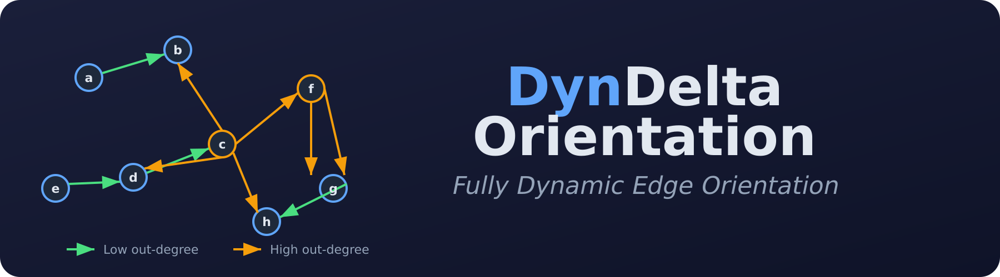
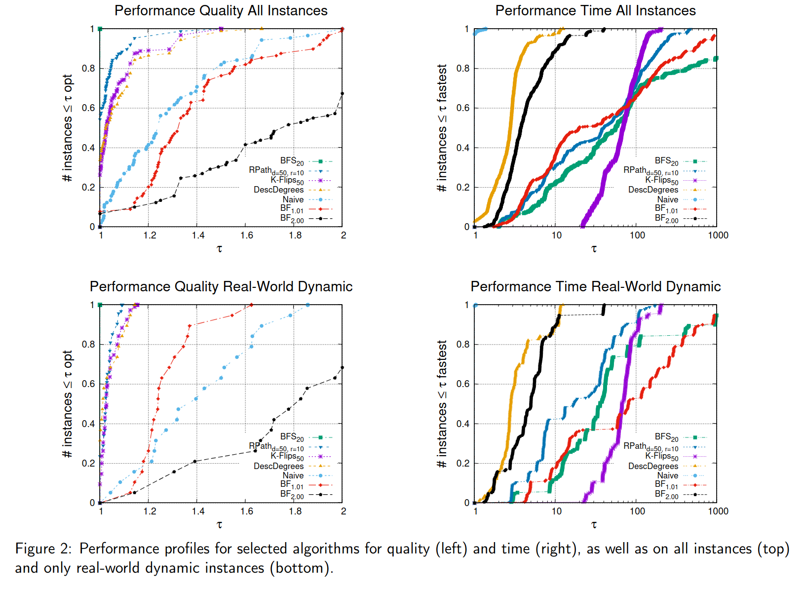

# DynDeltaOrientation: Fully Dynamic Edge Orientation

[](https://opensource.org/licenses/MIT)
[](https://en.cppreference.com/w/cpp/17)
[](https://cmake.org/)
[](https://github.com/DynGraphLab/DynDeltaOrientation)
[](https://github.com/DynGraphLab/DynDeltaOrientation)
[](https://github.com/DynGraphLab/homebrew-dyngraphlab)
[](https://github.com/DynGraphLab/DynDeltaOrientation/stargazers)
[](https://github.com/DynGraphLab/DynDeltaOrientation/issues)
[](https://github.com/DynGraphLab/DynDeltaOrientation/commits)
[](https://arxiv.org/abs/2301.06968)
[](https://arxiv.org/abs/2407.12595)
[](https://www.uni-heidelberg.de)

<p align="center">
  
</p>

Part of the [DynGraphLab &mdash; Dynamic Graph Algorithms](https://github.com/DynGraphLab) open source framework. Developed at the [Algorithm Engineering Group, Heidelberg University](https://ae.ifi.uni-heidelberg.de).

## Description

This repository implements and benchmarks state-of-the-art and new approaches for finding optimal as well as good delta-orientations in sparse graphs. The objective is to maintain an orientation of the edges in an undirected graph such that the maximum out-degree of any vertex remains low. When edges are inserted or deleted, it may be necessary to reorient some edges to prevent vertices from having excessively high out-degrees.

The repository contains two types of algorithms &mdash; **exact algorithms** and **heuristics**:
- The best heuristic algorithm, based on breadth-first search, computes the optimum result on **more than 90%** of instances and is on average only **2.4%** worse than the optimum solution.
- The exact algorithm maintains an optimal edge orientation during both insertions and deletions, with update times up to **6 orders of magnitude faster** than static exact algorithms.

<p align="center">

</p>

For optimal *static* algorithms, see [HeiOrient](https://github.com/HeiOrient/HeiOrient).

## Install via Homebrew

```console
brew install DynGraphLab/dyngraphlab/dyndeltaorientation
```

Then run:
```console
dyndeltaorientation FILE --algorithm=IMPROVEDOPT
```

## Installation (from source)

```console
git clone https://github.com/DynGraphLab/DynDeltaOrientation
cd DynDeltaOrientation
./compile_withcmake.sh -DILP=Off
```

All binaries are placed in `./deploy/`. To enable ILP-based algorithms (requires [Gurobi](https://www.gurobi.com/)):

```console
./compile_withcmake.sh -DILP=On
```

Alternatively, use the standard CMake process:

```console
mkdir build && cd build
cmake ../ -DCMAKE_BUILD_TYPE=Release -DILP=Off
make && cd ..
```

## Usage

```console
dyndeltaorientation FILE [options]
```

### Examples

```console
./deploy/delta-orientations examples/youtube-u-growth.seq --algorithm=IMPROVEDOPT
./deploy/delta-orientations examples/youtube-u-growth.seq --algorithm=NAIVE
./deploy/delta-orientations examples/youtube-u-growth.seq --algorithm=MAXDECENDING --depth=10
./deploy/delta-orientations examples/youtube-u-growth.seq --algorithm=KFLIPS --flips=10
```

For all available algorithms and options:

```console
./deploy/delta-orientations --help
```

## Input Format

Dynamic graph sequence format. The first line starts with `#` followed by the number of nodes and updates. Each subsequent line specifies an operation: `1 u v` for edge insertion, `0 u v` for edge deletion.

```
# 30399 87627
1 1 2
1 51 52
0 1 2
```

## License

The program is licensed under the [MIT License](https://opensource.org/licenses/MIT).
If you publish results using our algorithms, please acknowledge our work by citing the following papers.

When using the **heuristic** algorithms:

```bibtex
@inproceedings{DBLP:conf/acda/BorowitzG023,
  author       = {Jannick Borowitz and
                  Ernestine Gro{\ss}mann and
                  Christian Schulz},
  title        = {Engineering Fully Dynamic {\(\Delta\)}-Orientation Algorithms},
  booktitle    = {{SIAM} Conference on Applied and Computational Discrete Algorithms,
                  {ACDA} 2023},
  pages        = {25--37},
  publisher    = {{SIAM}},
  year         = {2023},
  doi          = {10.1137/1.9781611977714.3}
}
```

When using the **exact** algorithms:

```bibtex
@inproceedings{DBLP:conf/alenex/GrossmannR0W25,
  author       = {Ernestine Gro{\ss}mann and
                  Henrik Reinst{\"{a}}dtler and
                  Christian Schulz and
                  Fabian Walliser},
  title        = {Engineering Fully Dynamic Exact {\(\Delta\)}-Orientation Algorithms},
  booktitle    = {27th Symposium on Algorithm Engineering and Experiments,
                  {ALENEX} 2025},
  pages        = {15--28},
  publisher    = {{SIAM}},
  year         = {2025},
  doi          = {10.1137/1.9781611978339.2}
}
```
